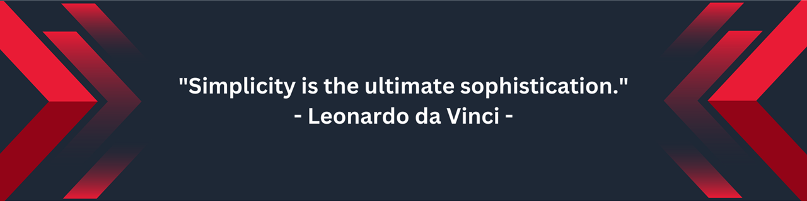

# Hi there, I'm SihunJo 👋
<!-- HEADER -->
<!-- 

    
    

 -->

  

    Welcome To JoSihun's Github
  

  

<h3><b>
Welcome to my GitHub Profile! 
I'm a passionate developer with experience in various skills and tools. 
Here's a quick overview of my stats, skills and the tools I use.
</b></h3>

## 📈 **GitHub Stats**

<!-- STATS CARD & TOP LANGUAGE CARD -->
<!-- 

    
    

 -->

    <!-- STATS CARD -->
    

    <!-- TOP LANGUAGE CARD -->
    

    

## 🚀 Skills

  
  
  
  
  
  
  
  
  
  
  
  
  
  
  
  
  

<h3>⚛️ Frontend Development ⚛️</h3>

  
  
  
  
  
  

<h3>🔧 Backend Development 🔧</h3>

  
  
  
  
  
  
  
  
  
  

<h3>📊 Data Analysis 📊</h3>

  
  
  
  

<h3>🛠 Other Skills 🛠</h3>

  
  
  

## 🛠️ Tools

  
  
  
  
  
  

  
  
  

## 📚 Studying

## 📫 Contact Me

  
  

<!-- FOOTER -->

